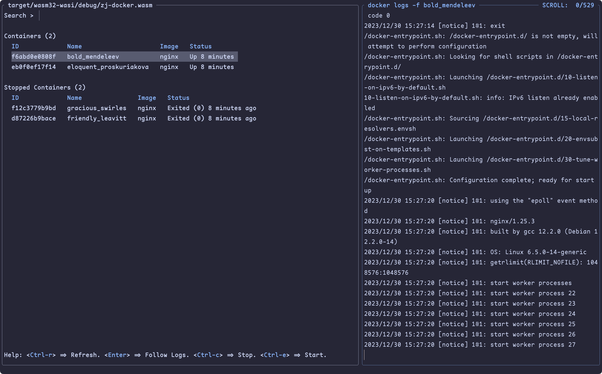

<h1 align="center">zj-docker 🐳</h1>

<p align="center">
  Zellij widget to display docker containers and perform basic operations on them.
  <br><br>
  <a href="https://github.com/dj95/zj-docker/releases">
    
  </a>
  <br><br>
  The goal of this plugin is to provide a convenient interface to docker containers within zellij.
  It provides a way to start and stop containers. Furthermore it tails logs of containers in new
  zellij panes.
</p>



## 🚀 Installation

Download the latest binary in the github releases. Place it somewhere, zellij is able to access it. Then the
plugin can be launched with a command or within a layout file..

You could also refer to the plugin guide from zellij, after downloading the binary: [https://zellij.dev/documentation/plugin-loading](https://zellij.dev/documentation/plugin-loading)

```bash
zellij plugin -- file:./target/wasm32-wasi/debug/zj-docker.wasm
```

## 🚧 Development

Make sure you have rust and the `wasm32-wasi` target installed. If using nix, you could utilize the nix-shell
in this repo for obtaining `cargo` and `rustup`. Then you'll only need to add the target with
`rustup target add wasm32-wasi`.

With the toolchain, simply build `zj-docker` with `cargo build`. Then you are able to run the example configuration
with `zellij -l plugin-dev-workspace.kdl` from the root of the repository.

## 🤝 Contributing

If you are missing features or find some annoying bugs please feel free to submit an issue or a bugfix within a pull request :)

## 📝 License

© 2023 Lev Perschin, Daniel Jankowski

This project is licensed under the MIT license.

Permission is hereby granted, free of charge, to any person obtaining a copy
of this software and associated documentation files (the "Software"), to deal
in the Software without restriction, including without limitation the rights
to use, copy, modify, merge, publish, distribute, sublicense, and/or sell
copies of the Software, and to permit persons to whom the Software is
furnished to do so, subject to the following conditions:

The above copyright notice and this permission notice shall be included in all
copies or substantial portions of the Software.

THE SOFTWARE IS PROVIDED "AS IS", WITHOUT WARRANTY OF ANY KIND, EXPRESS OR
IMPLIED, INCLUDING BUT NOT LIMITED TO THE WARRANTIES OF MERCHANTABILITY,
FITNESS FOR A PARTICULAR PURPOSE AND NONINFRINGEMENT. IN NO EVENT SHALL THE
AUTHORS OR COPYRIGHT HOLDERS BE LIABLE FOR ANY CLAIM, DAMAGES OR OTHER
LIABILITY, WHETHER IN AN ACTION OF CONTRACT, TORT OR OTHERWISE, ARISING FROM,
OUT OF OR IN CONNECTION WITH THE SOFTWARE OR THE USE OR OTHER DEALINGS IN THE
SOFTWARE.
